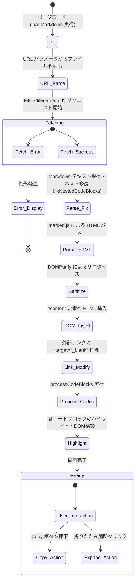

# 内部コンテキストと状態管理 (context.md)

⚠️ このドキュメントはリバースエンジニアリングにより自動生成された。

## 実行コンテキスト
ブラウザのメインスレッド（シングルスレッド）上のイベントループで実行される。

## 非同期処理と状態遷移

アプリケーションの初期化から表示完了までの非同期ライフサイクル。

### グローバル状態（設定値）
- `FOLD_THRESHOLD` (常数: `20`): コード折りたたみの境界行数。
- `SHOW_LINES` (常数: `10`): 折りたたみ時に残す上下の行数。
