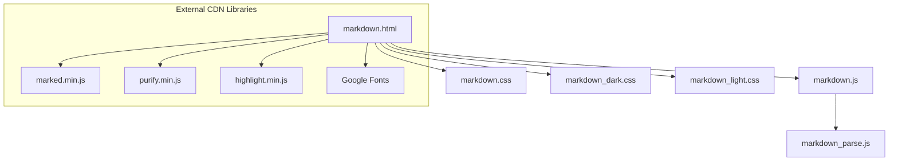

# モジュール構成 (modules.md)

⚠️ このドキュメントはリバースエンジニアリングにより自動生成された。

## モジュール一覧

| モジュール名 | ファイルパス | 責責・説明 |
|---|---|---|
| メインHTML | `markdown.html` | アプリケーションのエントリポイント。基本構造定義、外部 CDN 読み込み、および関連 CSS/JS のインポートを行う。 |
| UI・実行制御JS | `markdown.js` | ページの初期化、URL パラメータの解析、Markdown ファイルの Fetch 制御、およびコードブロック（コピー・スニップ）のイベントハンドリングを行う。 |
| 解析・パースJS | `markdown_parse.js` | Markdown パースの専門モジュール。ネストコードブロックの修復 (`fixNestedCodeBlocks`) と、`marked.js` + `DOMPurify` による HTML 変換を行う。 |
| 共通CSS | `markdown.css` | 共通のレイアウト、フォント設定、コードブロックラッパー、コピーボタン、スニッププレースホルダーなどの骨格スタイル。 |
| ダークテーマCSS | `markdown_dark.css` | ダークテーマ用の CSS 変数定義、およびダークテーマ用カラーデザインの適用。 |
| ライトテーマCSS | `markdown_light.css` | ライトテーマ用の CSS 変数定義、およびライトテーマ用カラーデザインの適用。 |

## 依存関係図

