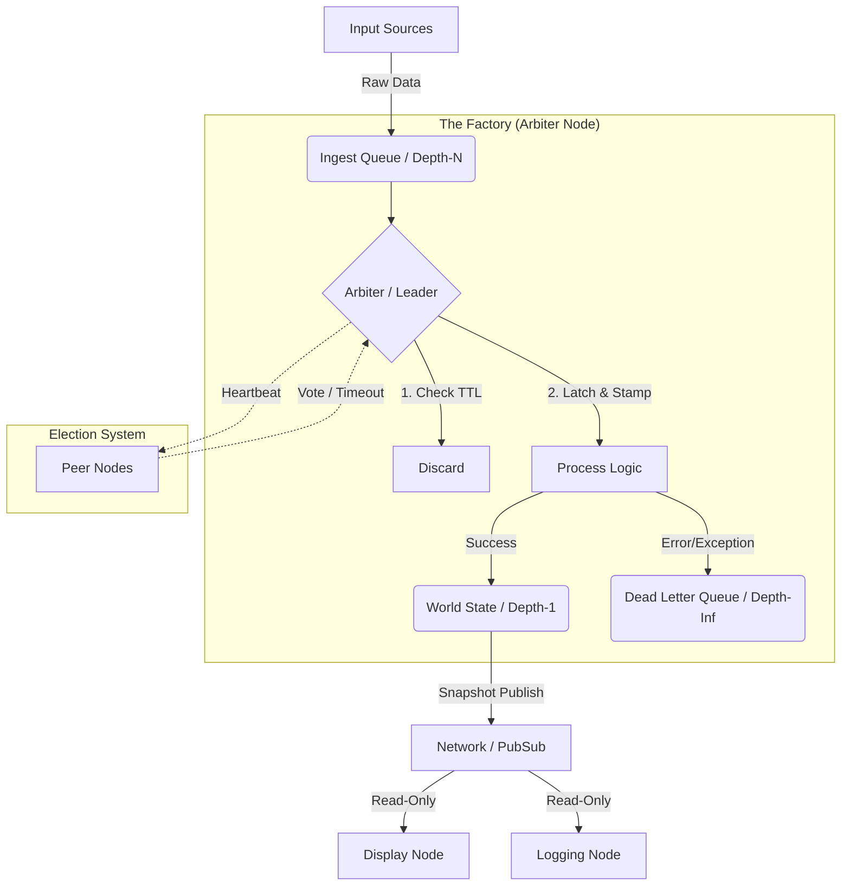

# 『Robust Micro-Factory (RMF) アーキテクチャ』 (The Codex of Robust Micro-Factory)

このアーキテクチャは、ソフトウェアを「処理」ではなく**「工場（Factory）」**と定義する。
工場は止まってはならない。時間は管理されなければならない。異物は排出されなければならない。

## 第1条：食品表示法 (The Law of Food Labeling)

**「素性の知れないデータは、１ビットたりともラインに乗せてはならない」**

全てのデータは、生の変数ではなく、必ず以下のメタデータを持つ「コンテナ（パケット）」に封入される。

1. **消費期限 (TTL)**:
* データには必ず「寿命」がある。期限切れのデータは処理せず、即座に廃棄（またはDLQ行き）とする。

2. **トレーサビリティ (Traceability)**:
* 「誰が（Producer）」「いつ（Harvest Time）」作ったかを明記する。

3. **工場検印 (Factory Stamp)**:
* 工場に取り込まれた瞬間、その時の「サイクル番号（Tick）」と「時代（Term）」を刻印する。これがこのデータにとっての「公式な誕生日」となる。

## 第2条：時空の支配 (The Law of Spacetime)

**「実時間を信じるな。工場長（Arbiter）の刻むリズムだけが世界だ」**

1. **論理時刻 (Tick)**:
* `time.time()` は参考値に過ぎない。工場長がループを回すたびに進む `Tick` カウンタこそが絶対時間である。
* 全ての処理結果は、この `Tick` に紐づく。これにより完全なリプレイ（再現）が可能になる。

2. **時代 (Term)**:
* 工場の支配体制を示すID。リーダーが変わるたびにインクリメントされる。
* `Term` が古いデータや命令は、新しい時代の前では無効である。

## 第3条：構造の物理学 (The Law of Physics)

**「全てはキューであり、状態はその断面に過ぎない」**

1. **キュー一元論 (Queue Monism)**:
* 関数呼び出しでデータを渡してはならない。必ずパイプ（キュー）を通せ。

2. **深度Nモデル (Depth-N)**:
* **搬入口 (Ingest Queue)**: `Depth=N`。バッファリングを行う。
* **状態 (State)**: `Depth=1`。常に最新の1つだけを保持する特殊なキュー（＝変数）。
* **廃棄場 (DLQ)**: `Depth=∞`。決して溢れさせてはならない無限のゴミ箱。

## 第4条：絶対的調停と選挙 (The Law of Governance)

**「書き込み権限を持つのは、選挙で選ばれたただ一人の王のみ」**

1. **Shared-Nothing**:
* メモリを共有するな。スレッド間で変数を触り合うな。全ては「嘆願書（Request）」としてキューに投函せよ。

2. **The Arbiter (調停者)**:
* 唯一、状態（State）を更新できる存在。
* 入力を取り出し、計算し、スタンプを押し、結果を「不変のスナップショット」として配布する。

3. **ストライキと選挙 (Raft Protocol)**:
* Arbiterからの「ハートビート」が途絶えたら、労働者（Node）は即座にストライキ（Timeout）を起こし、立候補（Candidate）する。
* 過半数の票を得た者が、新たなArbiter（Term N+1）として即位する。

## 第5条：工場の衛生管理 (The Law of Hygiene)

**「ラインを止めるな。毒物は袋詰めにして排出しろ」**

1. **Stop-the-World 禁止**:
* 例外（Exception）でプロセスを落としてはいけない。

2. **異物隔離 (Encapsulation)**:
* エラーが発生したら、そのデータとエラー内容をまとめて「二重の袋」に入れる。

3. **Dead Letter Queue (DLQ)**:
* 処理できないデータ、腐ったデータ、エラーデータは、メインラインから分岐させ、専用の「DLQ」へ流す。
* 人間は後でコーヒーを飲みながらDLQのログを分析する。

---

## 実装構成図 (Blueprint)

このルールに従って構築されるシステムは、以下のような形になる。

