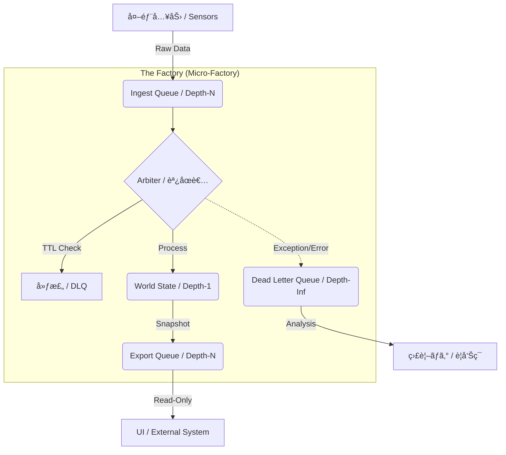

# Robust Micro-Factory (RMF) アーキテクãƒãƒ£ 技術解説書

## 1. 概念ã¨å“²å­¦ (Philosophy)

既存ã®ã€Œå‡¦ç†ã€ã¨ã„ã†æ¦‚念をæ¨ã¦ã‚。ソフトウェアを**「工場（Factory）ã€**ã¨å®šç¾©ã™ã‚‹ã€‚
工場ã«ãŠã‘るデータã¯ã€Œé£Ÿå“ã€ã§ã‚ã‚Šã€è…り（TTL切れ）ã€ç•°ç‰©ï¼ˆã‚¨ãƒ©ãƒ¼ï¼‰ãŒæ··å…¥ã™ã‚‹å¯èƒ½æ€§ãŒã‚る。
RMFã®ç›®çš„ã¯ã€**「ã„ã‹ãªã‚‹ç•°ç‰©ãŒæ··å…¥ã—ã¦ã‚‚ライン全体（プロセス）をåœæ­¢ã•ã›ãšã€æ·¡ã€…ã¨ä¸è‰¯å“ã‚’æ’出ã—続ã‘る堅牢ãªã‚·ã‚¹ãƒ†ãƒ ã€**を構築ã™ã‚‹ã“ã¨ã ã€‚

### アーキテクãƒãƒ£å…¨æ™¯


```mermaid
graph TD
    Source[外部入力 / Sensors] -->|Raw Data| IngestQ(Ingest Queue / Depth-N)
    
    subgraph "The Factory (Micro-Factory)"
        IngestQ --> Arbiter{Arbiter / 調åœè€…}
        Arbiter -->|TTL Check| Trash[廃棄 / DLQ]
        Arbiter -->|Process| State(World State / Depth-1)
        
        State -->|Snapshot| ExportQ(Export Queue / Depth-N)
        
        Arbiter -.->|Exception/Error| DLQ(Dead Letter Queue / Depth-Inf)
    end

    ExportQ -->|Read-Only| View[UI / External System]
    DLQ -->|Analysis| Log[監視ログ / 警告ç¯]

```

---

## 2. RMF 五箇æ¡ã®å¾¡èª“æ–‡ (The Codex)

コードを書ãå‰ã«ã€ä»¥ä¸‹ã®ç‰©ç†æ³•å‰‡ã‚’脳ã«å©ãè¾¼ã‚。

### 第1æ¡ï¼šé£Ÿå“表示法 (Food Labeling)

**「素性ã®çŸ¥ã‚Œãªã„データを1ビットãŸã‚Šã¨ã‚‚ラインã«ä¹—ã›ã‚‹ãªã€**
生㮠`int` ã‚„ `string` ã‚’æŒã¡æ­©ããªã€‚å¿…ãšã€Œã„ã¤ä½œã‚‰ã‚Œã€ã„ã¤è…ã‚‹ã‹ã€ã‚’æ˜è¨˜ã—㟠`FoodLabel` 付ãã®ãƒ‘ケットã«å°å…¥ã›ã‚ˆã€‚

### 第2æ¡ï¼šæ™‚空ã®æ”¯é… (Spacetime Control)

**「実時間を信ã˜ã‚‹ãªã€‚工場長（Arbiter）ã®ãƒªã‚ºãƒ ã ã‘ãŒä¸–ç•Œã ã€**
`time.time()` ã¯ãŸã ã®ã‚»ãƒ³ã‚µãƒ¼å€¤ã ã€‚ArbiterãŒãƒ«ãƒ¼ãƒ—ã‚’å›ã™ `Tick` ã“ããŒã€ã‚·ã‚¹ãƒ†ãƒ å†…ã®çµ¶å¯¾æ™‚é–“ã§ã‚る。

### 第3æ¡ï¼šã‚­ãƒ¥ãƒ¼ä¸€å…ƒè«– (Queue Monism)

**「関数ã§æ¸¡ã™ãªã€‚キューã«æ”¾ã‚Šè¾¼ã‚ã€**
コンãƒãƒ¼ãƒãƒ³ãƒˆé–“ã®æ¥ç¶šã¯ã™ã¹ã¦ã‚­ãƒ¥ãƒ¼ï¼ˆã‚³ãƒ³ãƒ™ã‚¢ï¼‰ã§è¡Œã†ã€‚

* **æ¬å…¥å£ (Ingest)**: ãƒãƒƒãƒ•ã‚¡ã‚ã‚Š (Depth-N)
* **廃棄場 (DLQ)**: ç„¡é™é•· (Depth-Infinite)

### 第4æ¡ï¼šçµ¶å¯¾çš„èª¿åœ (The Arbiter)

**「書ãè¾¼ã‚ã‚‹ã®ã¯ãŸã ä¸€äººã€**
状態（State）を更新ã§ãã‚‹ã®ã¯ `Arbiter` クラスã®ã¿ã€‚ä»–ã®èª°ã‚‚（スレッドもUIも）書ãè¾¼ã¿æ¨©é™ã‚’æŒãŸãªã„。彼らã¯ã€Œå˜†é¡˜æ›¸ï¼ˆRequest）ã€ã‚’キューã«å…¥ã‚Œã‚‹ã“ã¨ã—ã‹è¨±ã•ã‚Œãªã„。

### 第5æ¡ï¼šè¡›ç”Ÿç®¡ç† (Hygiene)

**「ラインを止ã‚ã‚‹ãªã€‚異物ã¯è¢‹è©°ã‚ã«ã—ã¦æ¨ã¦ã‚ã€**
例外 (`Exception`) ã§ã‚·ã‚¹ãƒ†ãƒ ã‚’クラッシュã•ã›ã‚‹ã“ã¨ã¯é‡ç½ªã ã€‚エラーã¯ãƒ‡ãƒ¼ã‚¿ã¨ã—ã¦ã€Œãƒ‘ッキングã€ã—ã€DLQ（Dead Letter Queue）ã¸é™ã‹ã«æµã›ã€‚

---

## 3. 実装プロトコル (Implementation Protocol)

開発ã¯ä»¥ä¸‹ã®é †åºã§é€²ã‚ã‚‹ã“ã¨ã€‚

### Phase 1: データスキーãƒã®å®šç¾©

ã¾ãšã€Œæµã‚Œã‚‹ã‚‚ã®ã€ã‚’定義ã™ã‚‹ã€‚ã“ã‚ŒãŒå…¨ã¦ã®åŸºç¤ã ã€‚

* **FoodLabel**: データã®ãƒ¡ã‚¿ãƒ‡ãƒ¼ã‚¿ï¼ˆIDã€è£½é€ æ™‚刻ã€æ¶ˆè²»æœŸé™ã€ç”Ÿç”£è€…）。
* **Packet**: データ本体ã¨ã‚¨ãƒ©ãƒ¼ãƒ­ã‚°ã‚’æ ¼ç´ã™ã‚‹ã‚³ãƒ³ãƒ†ãƒŠã€‚

### Phase 2: インフラã®æ•·è¨­

通信経路（Queue）を確ä¿ã™ã‚‹ã€‚

* **Ingest Queue**: 外部ã‹ã‚‰ã®å…¥åŠ›ã‚’å—ã‘付ã‘る。溢れãŸã‚‰ï¼ˆFullãªã‚‰ï¼‰å…¥åŠ›ã‚’æ‹’å¦ã™ã‚‹ã€‚
* **DLQ (Dead Letter Queue)**: **最もé‡è¦ã€‚** エラーã€æœŸé™åˆ‡ã‚Œã€äºˆæœŸã›ã¬ä¾‹å¤–ã¯ã™ã¹ã¦ã“ã“ã¸æµã™ã€‚ã“ã“ãŒæº¢ã‚Œã‚‹ï¼ã‚·ã‚¹ãƒ†ãƒ å´©å£Šã‚’æ„味ã™ã‚‹ãŸã‚ã€ç„¡é™é•·ã¾ãŸã¯ãƒ­ã‚°ãƒ•ã‚¡ã‚¤ãƒ«ã¸ã®ãƒ€ãƒ³ãƒ—機構をæŒã¤ã€‚

### Phase 3: 調åœè€… (Arbiter) ã®å®Ÿè£…

工場ã®ã€Œå¿ƒè‡“ã€ã‚’作る。

* **WorldState**: ãã®ç¬é–“ã®å…¨çŠ¶æ…‹ã‚’ä¿æŒã™ã‚‹ `dataclass` (Immutableæ¨å¥¨)。
* **Logic**: 1サイクル（Tick）ã”ã¨ã®å‡¦ç†ã€‚
1. **Fetch**: キューã‹ã‚‰ãƒ‘ケットをå–り出ã™ã€‚
2. **Validate**: `TTL` を確èªã€‚è…ã£ã¦ã„ãŸã‚‰DLQè¡Œã。
3. **Process**: ロジックを実行ã—ã€æ–°ã—ã„ `State` を生æˆã™ã‚‹ã€‚
4. **Catch**: 処ç†ä¸­ã®ä¾‹å¤–ã¯ã™ã¹ã¦ã‚­ãƒ£ãƒƒãƒã—ã€ãƒ‘ケットã«ã‚¨ãƒ©ãƒ¼æƒ…報を追記ã—ã¦DLQã¸é€ã‚‹ã€‚


### Phase 4: 監視体制 (Observability)

* **DLQ Monitor**: DLQを監視ã—ã€ç•°ç‰©ãŒæµã‚Œã¦ããŸã‚‰ãƒ­ã‚°å‡ºåŠ›ã‚„警告を行ã†ã€‚ã“ã‚Œã«ã‚ˆã‚Šã€Œãƒ—リントデãƒãƒƒã‚°ã€ãŒä¸è¦ã«ãªã‚‹ã€‚

---

## 4. RMF 標準実装コード (Reference Implementation)

ã“ã‚ŒãŒãŠå‰ã®Python環境ã«ãŠã‘る「ゴールデン・ãƒã‚¹ã‚¿ãƒ¼ã€ã ã€‚
エンコーディング宣言等ã®æŒ‡å®šã‚‚å映ã—ã¦ã„る。

```python
#!/usr/bin/env python3
# this is a ğŸğŸğŸ code.

"""
RMF (Robust Micro-Factory) Reference Implementation v1.0
Based on consolidated architecture docs.
"""

import time
import uuid
from dataclasses import dataclass, field, replace
from queue import Queue, Empty
from typing import Any, List, Optional

# --- Phase 1: Schema Definition (The Law of Food Labeling) ---

@dataclass(frozen=True)
class FoodLabel:
    """食å“表示ラベル：データã®ç´ æ€§ã¨å¯¿å‘½ã‚’管ç†"""
    trace_id: str = field(default_factory=lambda: str(uuid.uuid4()))
    created_at: float = field(default_factory=time.time)
    ttl: float = 5.0          # 秒。ã“れを超ãˆãŸã‚‰è…æ•—ã¨ã¿ãªã™
    producer: str = "unknown" # 生æˆå…ƒãƒ¢ã‚¸ãƒ¥ãƒ¼ãƒ«å

    def is_rotten(self) -> bool:
        """è…敗判定"""
        return (time.time() - self.created_at) > self.ttl

@dataclass
class Packet:
    """工場内をæµã‚Œã‚‹ã‚³ãƒ³ãƒ†ãƒŠ"""
    label: FoodLabel
    payload: Any
    errors: List[str] = field(default_factory=list)

    def add_error(self, msg: str):
        """異物（エラー情報）ã®æ··å…¥"""
        self.errors.append(f"[{time.time():.3f}] {msg}")

    @property
    def has_error(self) -> bool:
        return len(self.errors) > 0

# --- Phase 2: Infrastructure (The Law of Physics) ---

class FactoryInfrastructure:
    def __init__(self):
        # æ¬å…¥å£: センサーやAPIã‹ã‚‰ã®å…¥åŠ› (Depth-N)
        self.ingest_queue = Queue(maxsize=100)
        
        # 出è·å£: 最新ã®çŠ¶æ…‹ã‚¹ãƒŠãƒƒãƒ—ショット (Depth-N)
        self.export_queue = Queue(maxsize=100)

        # DLQ: 産業廃棄物 (Depth-Infinite / Limitless within memory)
        self.dlq = Queue()

# --- Phase 3: The Arbiter (The Law of Governance) ---

@dataclass(frozen=True)
class WorldState:
    """世界ã®æ–­é¢ (Immutable Snapshot)"""
    tick: int = 0
    last_update: float = 0.0
    system_status: str = "INIT"
    value: int = 0

class Arbiter:
    def __init__(self, infra: FactoryInfrastructure):
        self.infra = infra
        self.state = WorldState()

    def run_cycle(self):
        """1クロックサイクルã®å®Ÿè¡Œ (Main Loop内ã§å‘¼ã¶)"""
        try:
            # 1. æ¬å…¥ (Non-blocking)
            packet = self.infra.ingest_queue.get_nowait()
        except Empty:
            return # 入力ãŒãªã‘ã‚Œã°ä½•ã‚‚ã—ãªã„（ã¾ãŸã¯Heartbeatæ›´æ–°ã®ã¿è¡Œã†ï¼‰

        # 2. æ¤œå“ (TTLãƒã‚§ãƒƒã‚¯)
        if packet.label.is_rotten():
            packet.add_error("Expired (TTL Exceeded)")
            self._reject(packet)
            return

        # 3. 加工・状態更新 (ã“ã“ã ã‘㌠State ã‚’æ›´æ–°ã™ã‚‹)
        try:
            new_state = self._process_logic(self.state, packet)
            self.state = new_state
            
            # 4. å‡ºè· (Snapshotã®ç™ºè¡Œ)
            # Fullãªã‚‰å¤ã„ã‚‚ã®ã‚’æ¨ã¦ã¦æ–°ã—ã„ã‚‚ã®ã‚’入れる等ã®æˆ¦ç•¥ã‚’ã¨ã‚‹
            if not self.infra.export_queue.full():
                self.infra.export_queue.put(self.state)
            
        except Exception as e:
            # 5. 緊急æ’出 (The Law of Hygiene)
            packet.add_error(f"Processing Crash: {str(e)}")
            self._reject(packet)

    def _process_logic(self, current: WorldState, packet: Packet) -> WorldState:
        """純粋関数的ロジック"""
        # ビジãƒã‚¹ãƒ­ã‚¸ãƒƒã‚¯ä¾‹: ペイロードãŒæ•´æ•°ãªã‚‰åŠ ç®—ã€æ–‡å­—列ãªã‚‰ã‚¹ãƒ†ãƒ¼ã‚¿ã‚¹æ›´æ–°
        val = packet.payload
        
        if isinstance(val, int):
            return replace(current, 
                           tick=current.tick + 1,
                           value=current.value + val,
                           last_update=time.time())
        elif isinstance(val, str):
             # æ„図的ãªã‚¨ãƒ©ãƒ¼ç™ºç”Ÿãƒ†ã‚¹ãƒˆ
            if val == "POISON":
                raise ValueError("Toxic material detected!")
            
            return replace(current,
                           tick=current.tick + 1,
                           system_status=val,
                           last_update=time.time())
        else:
            return current

    def _reject(self, packet: Packet):
        """DLQã¸ã®å»ƒæ£„処ç†"""
        self.infra.dlq.put(packet)

# --- Phase 4 & 5: Workers & Monitoring ---

def sensor_worker(infra: FactoryInfrastructure):
    """外部入力シミュレータ"""
    # 正常データ
    p1 = Packet(FoodLabel(producer="SensorA"), payload=10)
    infra.ingest_queue.put(p1)
    
    # 毒物データ
    p2 = Packet(FoodLabel(producer="SensorB"), payload="POISON")
    infra.ingest_queue.put(p2)
    
    # è…ã£ãŸãƒ‡ãƒ¼ã‚¿ (TTL=0)
    p3 = Packet(FoodLabel(producer="SensorC", ttl=0.0), payload=999)
    time.sleep(0.1) # è…らã›ã‚‹
    infra.ingest_queue.put(p3)

def monitor_dlq(infra: FactoryInfrastructure):
    """廃棄物監視"""
    while not infra.dlq.empty():
        waste = infra.dlq.get()
        print(f"🔥 [DLQ ALERT] Source: {waste.label.producer} | Errors: {waste.errors}")

# --- Main Execution ---

if __name__ == "__main__":
    # セットアップ
    infra = FactoryInfrastructure()
    arbiter = Arbiter(infra)
    
    print("🭠Factory Started.")
    
    # 入力投入
    sensor_worker(infra)
    
    # å·¥å ´ç¨¼åƒ (数サイクル)
    for _ in range(5):
        arbiter.run_cycle()
        time.sleep(0.01)
        
    # çµæœç¢ºèª
    print(f"ğŸ Final State: {arbiter.state}")
    monitor_dlq(infra)

```

---

## 5. RMF é©åˆãƒã‚§ãƒƒã‚¯ãƒªã‚¹ãƒˆ

開発中ã€è¿·ã£ãŸã‚‰ã“れを見ã‚。

1. **「ãã®å¤‰æ•°ã€ã„ã¤è…る？ã€**
* `FoodLabel.ttl` ãŒå®šç¾©ã•ã‚Œã¦ã„ãªã„データã¯å­˜åœ¨ã—ã¦ã¯ãªã‚‰ãªã„。

2. **「ãã®ã‚¨ãƒ©ãƒ¼ã€ã©ã“ã¸è¡Œã？ã€**
* `catch` ã—ã¦æ¡ã‚Šã¤ã¶ã™ãªã€‚`DLQ` ã«å…¥ã‚Œã‚。

3. **「誰ãŒä¸–界を変ãˆã¦ã„る？ã€**
* `Arbiter` 以外ã®å ´æ‰€ã§ `self.state` ã«ä»£å…¥ã—ã¦ã¯ãªã‚‰ãªã„。

4. **「詰ã¾ã£ãŸã‚‰ã©ã†ã™ã‚‹ï¼Ÿã€**
* キューãŒæº¢ã‚ŒãŸæ™‚ã®æŒ™å‹•ï¼ˆDropã™ã‚‹ã‹Waitã™ã‚‹ã‹ï¼‰ã¯è¨­è¨ˆã•ã‚Œã¦ã„ã‚‹ã‹ï¼Ÿ
