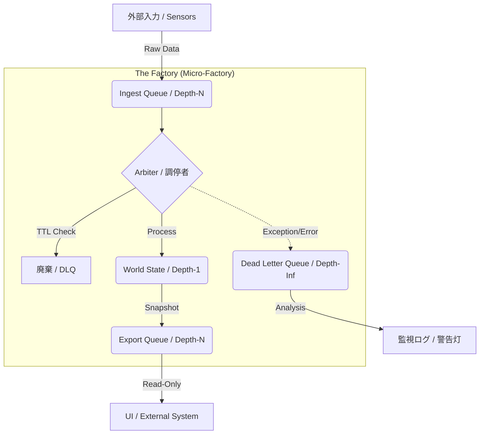

# Robust Micro-Factory (RMF) アーキテクチャ 技術解説書

## 1. 概念と哲学 (Philosophy)

既存の「処理」という概念を捨てろ。ソフトウェアを**「工場（Factory）」**と定義する。
工場におけるデータは「食品」であり、腐り（TTL切れ）、異物（エラー）が混入する可能性がある。
RMFの目的は、**「いかなる異物が混入してもライン全体（プロセス）を停止させず、淡々と不良品を排出し続ける堅牢なシステム」**を構築することだ。

### アーキテクチャ全景



---

## 2. RMF 五箇条の御誓文 (The Codex)

コードを書く前に、以下の物理法則を脳に叩き込め。

### 第1条：食品表示法 (Food Labeling)

**「素性の知れないデータを1ビットたりともラインに乗せるな」**
生の `int` や `string` を持ち歩くな。必ず「いつ作られ、いつ腐るか」を明記した `FoodLabel` 付きのパケットに封入せよ。

### 第2条：時空の支配 (Spacetime Control)

**「実時間を信じるな。工場長（Arbiter）のリズムだけが世界だ」**
`time.time()` はただのセンサー値だ。Arbiterがループを回す `Tick` こそが、システム内の絶対時間である。

### 第3条：キュー一元論 (Queue Monism)

**「関数で渡すな。キューに放り込め」**
コンポーネント間の接続はすべてキュー（コンベア）で行う。

* **搬入口 (Ingest)**: バッファあり (Depth-N)
* **廃棄場 (DLQ)**: 無限長 (Depth-Infinite)

### 第4条：絶対的調停 (The Arbiter)

**「書き込めるのはただ一人」**
状態（State）を更新できるのは `Arbiter` クラスのみ。他の誰も（スレッドもUIも）書き込み権限を持たない。彼らは「嘆願書（Request）」をキューに入れることしか許されない。

### 第5条：衛生管理 (Hygiene)

**「ラインを止めるな。異物は袋詰めにして捨てろ」**
例外 (`Exception`) でシステムをクラッシュさせることは重罪だ。エラーはデータとして「パッキング」し、DLQ（Dead Letter Queue）へ静かに流せ。

---

## 3. 実装プロトコル (Implementation Protocol)

開発は以下の順序で進めること。

### Phase 1: データスキーマの定義

まず「流れるもの」を定義する。これが全ての基礎だ。

* **FoodLabel**: データのメタデータ（ID、製造時刻、消費期限、生産者）。
* **Packet**: データ本体とエラーログを格納するコンテナ。

### Phase 2: インフラの敷設

通信経路（Queue）を確保する。

* **Ingest Queue**: 外部からの入力を受け付ける。溢れたら（Fullなら）入力を拒否する。
* **DLQ (Dead Letter Queue)**: **最も重要。** エラー、期限切れ、予期せぬ例外はすべてここへ流す。ここが溢れる＝システム崩壊を意味するため、無限長またはログファイルへのダンプ機構を持つ。

### Phase 3: 調停者 (Arbiter) の実装

工場の「心臓」を作る。

* **WorldState**: その瞬間の全状態を保持する `dataclass` (Immutable推奨)。
* **Logic**: 1サイクル（Tick）ごとの処理。
1. **Fetch**: キューからパケットを取り出す。
2. **Validate**: `TTL` を確認。腐っていたらDLQ行き。
3. **Process**: ロジックを実行し、新しい `State` を生成する。
4. **Catch**: 処理中の例外はすべてキャッチし、パケットにエラー情報を追記してDLQへ送る。


### Phase 4: 監視体制 (Observability)

* **DLQ Monitor**: DLQを監視し、異物が流れてきたらログ出力や警告を行う。これにより「プリントデバッグ」が不要になる。

---

## 4. RMF 標準実装コード (Reference Implementation)

これがお前のPython環境における「ゴールデン・マスター」だ。
エンコーディング宣言等の指定も反映している。

```python
#!/usr/bin/env python3
# this is a 🐍🐍🐍 code.

"""
RMF (Robust Micro-Factory) Reference Implementation v1.0
Based on consolidated architecture docs.
"""

import time
import uuid
from dataclasses import dataclass, field, replace
from queue import Queue, Empty
from typing import Any, List, Optional

# --- Phase 1: Schema Definition (The Law of Food Labeling) ---

@dataclass(frozen=True)
class FoodLabel:
    """食品表示ラベル：データの素性と寿命を管理"""
    trace_id: str = field(default_factory=lambda: str(uuid.uuid4()))
    created_at: float = field(default_factory=time.time)
    ttl: float = 5.0          # 秒。これを超えたら腐敗とみなす
    producer: str = "unknown" # 生成元モジュール名

    def is_rotten(self) -> bool:
        """腐敗判定"""
        return (time.time() - self.created_at) > self.ttl

@dataclass
class Packet:
    """工場内を流れるコンテナ"""
    label: FoodLabel
    payload: Any
    errors: List[str] = field(default_factory=list)

    def add_error(self, msg: str):
        """異物（エラー情報）の混入"""
        self.errors.append(f"[{time.time():.3f}] {msg}")

    @property
    def has_error(self) -> bool:
        return len(self.errors) > 0

# --- Phase 2: Infrastructure (The Law of Physics) ---

class FactoryInfrastructure:
    def __init__(self):
        # 搬入口: センサーやAPIからの入力 (Depth-N)
        self.ingest_queue = Queue(maxsize=100)
        
        # 出荷口: 最新の状態スナップショット (Depth-N)
        self.export_queue = Queue(maxsize=100)

        # DLQ: 産業廃棄物 (Depth-Infinite / Limitless within memory)
        self.dlq = Queue()

# --- Phase 3: The Arbiter (The Law of Governance) ---

@dataclass(frozen=True)
class WorldState:
    """世界の断面 (Immutable Snapshot)"""
    tick: int = 0
    last_update: float = 0.0
    system_status: str = "INIT"
    value: int = 0

class Arbiter:
    def __init__(self, infra: FactoryInfrastructure):
        self.infra = infra
        self.state = WorldState()

    def run_cycle(self):
        """1クロックサイクルの実行 (Main Loop内で呼ぶ)"""
        try:
            # 1. 搬入 (Non-blocking)
            packet = self.infra.ingest_queue.get_nowait()
        except Empty:
            return # 入力がなければ何もしない（またはHeartbeat更新のみ行う）

        # 2. 検品 (TTLチェック)
        if packet.label.is_rotten():
            packet.add_error("Expired (TTL Exceeded)")
            self._reject(packet)
            return

        # 3. 加工・状態更新 (ここだけが State を更新する)
        try:
            new_state = self._process_logic(self.state, packet)
            self.state = new_state
            
            # 4. 出荷 (Snapshotの発行)
            # Fullなら古いものを捨てて新しいものを入れる等の戦略をとる
            if not self.infra.export_queue.full():
                self.infra.export_queue.put(self.state)
            
        except Exception as e:
            # 5. 緊急排出 (The Law of Hygiene)
            packet.add_error(f"Processing Crash: {str(e)}")
            self._reject(packet)

    def _process_logic(self, current: WorldState, packet: Packet) -> WorldState:
        """純粋関数的ロジック"""
        # ビジネスロジック例: ペイロードが整数なら加算、文字列ならステータス更新
        val = packet.payload
        
        if isinstance(val, int):
            return replace(current, 
                           tick=current.tick + 1,
                           value=current.value + val,
                           last_update=time.time())
        elif isinstance(val, str):
             # 意図的なエラー発生テスト
            if val == "POISON":
                raise ValueError("Toxic material detected!")
            
            return replace(current,
                           tick=current.tick + 1,
                           system_status=val,
                           last_update=time.time())
        else:
            return current

    def _reject(self, packet: Packet):
        """DLQへの廃棄処理"""
        self.infra.dlq.put(packet)

# --- Phase 4 & 5: Workers & Monitoring ---

def sensor_worker(infra: FactoryInfrastructure):
    """外部入力シミュレータ"""
    # 正常データ
    p1 = Packet(FoodLabel(producer="SensorA"), payload=10)
    infra.ingest_queue.put(p1)
    
    # 毒物データ
    p2 = Packet(FoodLabel(producer="SensorB"), payload="POISON")
    infra.ingest_queue.put(p2)
    
    # 腐ったデータ (TTL=0)
    p3 = Packet(FoodLabel(producer="SensorC", ttl=0.0), payload=999)
    time.sleep(0.1) # 腐らせる
    infra.ingest_queue.put(p3)

def monitor_dlq(infra: FactoryInfrastructure):
    """廃棄物監視"""
    while not infra.dlq.empty():
        waste = infra.dlq.get()
        print(f"🔥 [DLQ ALERT] Source: {waste.label.producer} | Errors: {waste.errors}")

# --- Main Execution ---

if __name__ == "__main__":
    # セットアップ
    infra = FactoryInfrastructure()
    arbiter = Arbiter(infra)
    
    print("🏭 Factory Started.")
    
    # 入力投入
    sensor_worker(infra)
    
    # 工場稼働 (数サイクル)
    for _ in range(5):
        arbiter.run_cycle()
        time.sleep(0.01)
        
    # 結果確認
    print(f"🏁 Final State: {arbiter.state}")
    monitor_dlq(infra)

```

---

## 5. RMF 適合チェックリスト

開発中、迷ったらこれを見ろ。

1. **「その変数、いつ腐る？」**
* `FoodLabel.ttl` が定義されていないデータは存在してはならない。

2. **「そのエラー、どこへ行く？」**
* `catch` して握りつぶすな。`DLQ` に入れろ。

3. **「誰が世界を変えている？」**
* `Arbiter` 以外の場所で `self.state` に代入してはならない。

4. **「詰まったらどうする？」**
* キューが溢れた時の挙動（DropするかWaitするか）は設計されているか？
